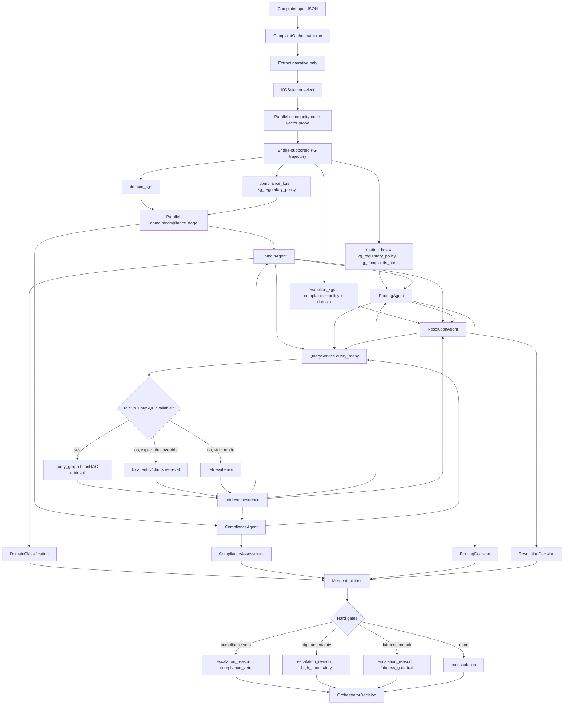

Multi-Agent Reasoning on Bridged Knowledge Graphs for Complaint Triage

## Setup

Create a conda environment with python=3.11

```bash
conda create -n triage python=3.11
conda activate triage
```

## System Overview

This project is an AI complaint triage platform for consumer-finance operations. Given a CFPB-style complaint, it:

- accepts structured complaint records while exposing only the complaint narrative to the agents by default,
- retrieves graph-grounded evidence from one or more knowledge graphs,
- classifies product and issue context,
- assesses compliance risk,
- chooses an owning route,
- proposes a resolution plan and customer response,
- emits an auditable `decision_trace`.

LeanRAG is the evidence engine. The orchestrator and agents are the decision layer.

## Runtime Stack

- **Local model serving:** Ollama OpenAI-compatible endpoint at `http://localhost:11434/v1`.
- **Chat / extraction model:** `gemma4:e2b` by default in `config.yaml`.
- **Embedding model:** `embeddinggemma`.
- **Vector index:** local Milvus Lite database at `<kg working_dir>/milvus_demo.db`.
- **Graph store:** MySQL databases named after each KG working directory basename, with `entities`, `relations`, and `communities` tables.
- **Structured agent outputs:** Pydantic models in `agents/schemas.py`, passed as JSON schema `response_format`.
- **Observability:** `TraceRecorder` emits compact JSONL stage events, optional stderr streaming, optional HTML reports, and optional Langfuse spans.
- **Langfuse experiments:** `evaluation/run_langfuse_experiment.py` creates/reuses Langfuse datasets, runs the orchestrator as a dataset experiment, emits per-item scores, and writes aggregate run scores.

## LeanRAG Workflow

LeanRAG operates in two phases.

### Phase A: Build-Time

1. **Ingest sources**
   - CFPB/XML/PDF sources are fetched or imported into raw source JSON.
   - Title 12/XML utilities live under `ingestion/`.

2. **Prepare chunks**
   - `ingestion/prepare_chunks.py` splits source documents into traceable chunks.

3. **Extract triples**
   - `ingestion/extract_triples.py` calls the configured local LLM to extract entities and relations.
   - Outputs are written as `entity.jsonl` and `relation.jsonl`.

4. **Build graph hierarchy and indexes**
   - `build_graph.py` runs hierarchical clustering/community generation.
   - Embedding dimension comes from `config.yaml` (`model_params.openai_embedding_dim`, currently `768` for `embeddinggemma`).
   - `_cluster_utils.py` normalizes model JSON variants and emits progress/logging.

5. **Build bridge edges**
   - `bridges/build_bridges.py` creates accepted bridge edges and review candidates.
   - Current bridge scoring combines normalized names, aliases, legal citations, neighborhood overlap, generic-name penalties, and optional embedding similarity.

### Phase B: Query-Time

1. The orchestrator extracts the complaint narrative from the input record.
2. The orchestrator calls `KGSelector.select(...)` from `kg_selection.py`.
3. `KGSelector` first tries a parallel community-node vector probe over enabled KGs with available LeanRAG vector indexes.
4. `KGSelector` uses accepted bridge edges to score a plausible cross-KG trajectory from the top community hits.
6. `KGSelector` also emits `resolution_kgs`, which always prioritizes the complaint taxonomy and regulatory policy KGs before the selected domain KGs.
7. Each agent retrieves evidence through `QueryService.query_many`.
   - Domain and compliance run in parallel after KG selection because they do not depend on each other.
   - Routing runs after domain because it uses the domain product hint.
   - Resolution runs after domain and routing because it uses the domain classification and owner route.
   - Each agent issues one retrieval request; LeanRAG handles graph traversal and evidence construction inside that request.
8. `QueryService` uses full LeanRAG retrieval through Milvus Lite and MySQL graph tables. If strict retrieval is enabled and LeanRAG artifacts are missing, the request fails instead of using local entity/chunk search.
9. Agents make Pydantic-validated LLM decisions from complaint text plus retrieved evidence.

## Knowledge Graphs

We use five full knowledge graphs from `configs/kg_registry.yaml`. Each KG is independently built and indexed, then selected or queried by the orchestrator according to the complaint narrative and agent role.

| KG | Primary Scope | Typical Agent Usage |
| --- | --- | --- |
| `kg_complaints_core` | CFPB complaint taxonomy, product/sub-product/issue/sub-issue options, complaint intake/process context, and complaint-form structure. | Always important for domain classification and resolution planning; also supports routing by grounding the complaint in the official CFPB taxonomy. |
| `kg_credit_domain` | Credit-card operations, credit reporting, furnishing, disputes, account terms, fees, billing, investigations, and consumer-report issues. | Domain classification for credit-card and credit-reporting complaints; route selection for `card_ops` and `credit_reporting_ops`; resolution evidence for dispute and furnishing workflows. |
| `kg_lending_domain` | Loans, mortgages, student loans, vehicle loans, payday/title/personal loans, servicing, payoff, repayment, delinquency, repossession, and loan-related credit-report impacts. | Domain classification and resolution planning for lending products; route selection for `lending_ops`; compliance context for servicing and collections-like complaints. |
| `kg_banking_domain` | Checking/savings accounts, deposits, payments, debit/ATM card issues, transfers, account access, account closure, fraud/disputes, and Regulation E/Open Banking context. | Domain classification and resolution planning for digital banking complaints; route selection for `digital_banking`; evidence for funds availability, unauthorized transactions, and account access issues. |
| `kg_regulatory_policy` | CFPB policy, UDAAP, complaint handling expectations, consumer-finance regulatory procedures, risk indicators, and compliance review context. | Always used by the compliance agent; prioritized for routing and resolution so plans and customer responses stay regulator-safe. |

The orchestrator does not send every KG to every agent blindly. `KGSelector` selects domain KGs from the narrative, while fixed role policies ensure that:

- compliance queries prioritize `kg_regulatory_policy`,
- routing queries use `kg_regulatory_policy` plus `kg_complaints_core`,
- resolution queries prioritize `kg_complaints_core` and `kg_regulatory_policy`, then add selected domain KGs,
- domain classification uses selected product/domain KGs plus complaint taxonomy evidence.

## KG Storage and Index Artifacts

The registry files are the source of truth for where KGs live:

- `configs/kg_registry.yaml`: full registry under `datasets/`.

Each registry entry has:

- `kg_id`: logical KG name used by agents and bridge edges.
- `working_dir`: directory containing KG artifacts.
- `chunks_file`: source chunk JSON used to recover text evidence.
- `topk`: retrieval result count.
- `level_mode`: LeanRAG vector-search level. `0` means raw entity nodes, `1` means aggregate/community nodes, and other values mean all nodes.
- `enabled`: whether the KG can be selected or queried.

Full registry:

| KG | Working Directory | Chunk File |
| --- | --- | --- |
| `kg_complaints_core` | `datasets/complaints_core` | `datasets/complaints_core/complaints_core_chunk.json` |
| `kg_credit_domain` | `datasets/credit_domain` | `datasets/credit_domain/credit_domain_chunk.json` |
| `kg_lending_domain` | `datasets/lending_domain` | `datasets/lending_domain/lending_domain_chunk.json` |
| `kg_banking_domain` | `datasets/banking_domain` | `datasets/banking_domain/banking_domain_chunk.json` |
| `kg_regulatory_policy` | `datasets/regulatory_policy` | `datasets/regulatory_policy/regulatory_policy_chunk.json` |

Each KG working directory can contain several artifact layers:

| Artifact | Producer | Purpose |
| --- | --- | --- |
| `*_chunk.json` | `ingestion/prepare_chunks.py` | Traceable text chunks used for source evidence. |
| `entity.jsonl` | `ingestion/extract_triples.py` | Extracted raw entities and descriptions. |
| `relation.jsonl` | `ingestion/extract_triples.py` | Extracted raw relations. |
| `all_entities.json` | `build_graph.py` | Raw plus aggregate/community nodes with hierarchy metadata. |
| `generate_relations.json` | `build_graph.py` | Generated hierarchical/community relations. |
| `community.json` | `build_graph.py` | Community reports: names, descriptions, findings, and children. |
| `milvus_demo.db` | `database_utils.build_vector_search` | Local Milvus Lite vector index over raw/community nodes. Required for full LeanRAG vector retrieval and community-probe KG selection. |

The build also creates MySQL state. `build_graph.py` calls `create_db_table_mysql()` and `insert_data_to_mysql()` in `database_utils.py`. The database name is the basename of the KG `working_dir`, for example:

- `datasets_fast/complaints_core` -> MySQL database `complaints_core`
- `datasets_fast/banking_domain` -> MySQL database `banking_domain`
- `datasets_fast/regulatory_policy` -> MySQL database `regulatory_policy`

Each KG database has:

| Table | Contents | Used By |
| --- | --- | --- |
| `entities` | entity/community node descriptions, parent pointers, source ids, level | LeanRAG reasoning paths and hierarchy lookup |
| `relations` | generated links between nodes/communities | LeanRAG reasoning path descriptions |
| `communities` | community summaries and findings | aggregate context in `query_graph.py` |

## Multi-Agent Design

The orchestrator currently uses four specialist agents under `agents/`:

- **DomainAgent**
  - Retrieves domain evidence.
  - Classifies internal `product` / `issue` labels.
  - Predicts internal labels from the narrative and retrieved evidence.
  - Loads the CFPB product/sub-product/issue/sub-issue taxonomy from the complaint-form catalog and gives the model a ranked candidate set, so `cfpb_*` fields are selected from allowed taxonomy paths rather than generated open-ended.
  - Uses deterministic guardrails to fill strong missing CFPB taxonomy fields from the top candidate and to keep internal normalized labels aligned with strong narrative keyword evidence.
  - Can still preserve labeled CFPB metadata if called directly with labeled text, but the orchestrator does not include those labels in normal agent prompts.

- **ComplianceAgent**
  - Retrieves regulatory evidence.
  - Uses a Pydantic-validated LLM decision for `compliance_risk`, `veto`, `policy_checks`, confidence, and rationale.

- **RoutingAgent**
  - Retrieves routing/policy evidence.
  - Uses a Pydantic-validated LLM decision for the owner team route.
  - Allowed routes are defined by `RouteLabel` in `agents/schemas.py`.

- **ResolutionAgent**
  - Retrieves from `resolution_kgs`, which prioritize complaint taxonomy, regulatory policy, and selected domain KGs.
  - Uses a single classification-aware LeanRAG retrieval request.
  - Uses a Pydantic-validated LLM decision for the operational action plan, customer response, and preventive recommendations.
  - Fails closed if the model is unavailable or does not return valid structured output.

All LLM decision calls use the shared helpers in:

- `agents/schemas.py`
- `agents/structured_output.py`
- `agents/llm_utils.py`

## Structured Output Contract

Pydantic schemas define the decision outputs:

- `DomainClassification`
- `ComplianceAssessment`
- `RoutingDecision`
- `ResolutionDecision`

The structured-output helper:

1. passes `response_format={"type": "json_schema", ...}` to the OpenAI-compatible model call,
2. validates with `model_validate_json`,
3. uses deterministic JSON-object extraction plus `model_validate` for models that wrap schema JSON in extra text,
4. returns a structured error if validation still fails.

By default, `configs/policy.yaml` sets `allow_agent_fallbacks: false`, `allow_structured_repair: false`, and `allow_empty_response_retry: false`. This keeps the production path deterministic: invalid JSON, schema mismatches, empty responses, unavailable LLMs, or missing required evidence fail the request instead of producing a substituted rules/template answer.

Important boundary:

- Pydantic validates structure, allowed labels, and numeric ranges.
- In normal orchestrator runs, CFPB taxonomy fields in the input are ground truth metadata only; they are not included in agent prompts.
- The DomainAgent may still output exact `cfpb_*` labels because it is given the public CFPB taxonomy catalog and ranked candidate paths, not the sample's answer labels.

## Runtime Request Path



## Build and Operations CLI

`run_pipeline.py` is the operational entrypoint.

Common commands:

```bash
conda run --no-capture-output -n triage python run_pipeline.py ingest \
  --registry configs/kg_registry_fast.yaml \
  --xml-root data/xml_sources_fast \
  --raw-out datasets_fast/raw_sources \
  --verbose-logging
```

```bash
conda run --no-capture-output -n triage python run_pipeline.py extract-triples \
  --registry configs/kg_registry_fast.yaml \
  --max-concurrency 1 \
  --verbose-logging
```

```bash
conda run --no-capture-output -n triage python run_pipeline.py build-kgs \
  --registry configs/kg_registry_fast.yaml \
  --run-commands \
  --verbose-logging
```

```bash
conda run --no-capture-output -n triage python run_pipeline.py build-bridges \
  --registry configs/kg_registry_fast.yaml \
  --output bridges/bridge_edges_fast_semantic.json \
  --review-output bridges/bridge_edges_fast_semantic_review.json \
  --replace \
  --semantic \
  --verbose-logging
```

```bash
conda run --no-capture-output -n triage python run_pipeline.py orchestrate \
  --registry configs/kg_registry_fast.yaml \
  --bridges bridges/bridge_edges_fast_semantic.json \
  --input samples/cfpb_complaint_7997511.json
```

For development only, `query`, `orchestrate`, and the evaluator accept `--allow-local-fallback` to use entity/chunk file search when Milvus/MySQL are unavailable.

## Bridge Model

Bridge edges connect related entities or communities across KGs without merging the KGs.

Accepted bridge edges are written to the primary bridge file. Lower-confidence candidates are written to a review file.

Current bridge evidence signals include:

- normalized exact name match,
- alias overlap,
- shared legal citations,
- token/name similarity,
- description token overlap,
- neighborhood token overlap,
- embedding similarity,
- generic entity penalties,
- regulation-letter guards to avoid false matches like `Regulation E` to `Regulation M`.

This gives cross-KG explainability while keeping each KG independently governable.

At selection time, `KGSelector` treats bridges as navigation evidence between retrieved community hits. Existing entity-level bridges support a community hop when the bridge endpoint appears in the community name or description. Community-to-community bridges can be added later as a cleaner navigation layer while preserving entity bridges for fine-grained audit evidence.

## Decision Trace

Each orchestrator result includes:

- `classification`
- `severity`
- `compliance_risk`
- `route`
- `resolution_plan`
- `customer_response`
- `decision_trace`
- `escalate`

`decision_trace` includes:

- `agent_evidence`
- `agent_decisions`
- `kg_selection`
- `bridge_hops`
- `policy_checks`
- `confidence`
- `uncertainty`
- `escalation_reason`

`agent_decisions` records each agent's decision source, confidence, rationale, error if present, and any deterministic guardrail annotation. In the default runtime, the decision source should be `llm` for every successful agent.

`kg_selection` records the selected KGs, combined domain KG scores, selector method, community hits, and bridge trajectory so routing choices are inspectable.

## Evaluation

`evaluation/evaluate_orchestrator.py` evaluates the multi-agent system on complaint samples.

Metrics include:

- CFPB taxonomy exact match for `product`, `sub_product`, `issue`, `sub_issue`,
- overall taxonomy exact-match accuracy,
- whether all decision agents used LLM outputs,
- structured-output errors,
- decision trace validity,
- customer response presence,
- resolution action count,
- route/owner-team consistency,
- confidence, uncertainty, compliance risk, and escalation.

Example:

```bash
conda run --no-capture-output -n triage python evaluation/evaluate_orchestrator.py \
  --registry configs/kg_registry_fast.yaml \
  --bridges bridges/bridge_edges_fast_semantic.json \
  --input samples/cfpb_complaint_7997511.json \
  --output evaluation/results/cfpb_complaint_7997511_eval.json
```

Evaluation keeps CFPB labels as ground truth but hides them from model input by default:

```bash
conda run --no-capture-output -n triage python evaluation/evaluate_orchestrator.py \
  --registry configs/kg_registry_fast.yaml \
  --bridges bridges/bridge_edges_fast_semantic.json \
  --input samples/cfpb_complaint_7997511.json \
  --output evaluation/results/cfpb_complaint_7997511_eval_narrative_only.json
```

### Langfuse Dataset Experiments

`evaluation/run_langfuse_experiment.py` is the current full-run evaluation entrypoint. It:

1. creates or reuses a Langfuse dataset,
2. creates deterministic dataset items keyed by complaint id,
3. runs `ComplaintOrchestrator` against each dataset item,
4. stores compact orchestrator outputs as Langfuse trace outputs,
5. emits per-item scores from `evaluate_orchestrator.py`,
6. publishes run-level average scores to the Langfuse dataset run.

The 90-sample CFPB experiment used:

| Field | Value |
| --- | --- |
| Dataset | `cfpb-90-stratified-labeled` |
| Run name | `full-registry-20260512-175914` |
| Dataset run id | `6efb65eb-62e6-4cd5-b3ce-cc1ae393f8b2` |
| Input | `evaluation/inputs/cfpb_90_stratified_labeled.json` |
| Relabeled input | `evaluation/inputs/cfpb_90_relabelled.json` |
| Registry | `configs/kg_registry.yaml` |
| Bridges | `bridges/bridge_edges.json` |
| Agent model | `gemma4:e2b` |

Command shape:

```bash
conda run --no-capture-output -n triage python evaluation/run_langfuse_experiment.py \
  --input evaluation/inputs/cfpb_90_stratified_labeled.json \
  --dataset-name cfpb-90-stratified-labeled \
  --run-name full-registry-20260512-175914 \
  --registry configs/kg_registry.yaml \
  --bridges bridges/bridge_edges.json \
  --allow-local-fallback \
  --max-concurrency 1 \
  --output outputs/evals/langfuse_experiment_result.json
```

The latest stored exact-match aggregate artifact is `outputs/evals/langfuse_experiment_result.json`.

### Current 90-Sample Results

The original `gemma4:e2b` 90-sample run completed 88 of 90 complaints. The latest local artifacts summarize the run as follows:

| Metric | Score |
| --- | ---: |
| Evaluation success | `0.9778` |
| Decision trace valid | `1.0000` |
| Customer response present | `1.0000` |
| Resolution completeness | `0.9972` |
| Route matches resolution owner | `1.0000` |
| Strict taxonomy exact-match accuracy | `0.1932` |
| Strict expected route match | `0.4773` |
| Lax judge taxonomy alignment | `0.4167` |
| Lax judge route alignment | `0.6056` |
| Judge resolution plan quality | `0.7056` |
| Judge consumer response quality | `0.4972` |
| Judge compliance quality | `0.5939` |
| Judge root-cause quality | `0.4600` |
| Judge prevention quality | `0.6161` |
| Judge explainability quality | `0.7017` |
| Judge overall operational quality | `0.6050` |

Interpretation:

- The agentic workflow is reliable enough to produce structured triage artifacts for most complaints.
- Fine-grained CFPB taxonomy classification remains the weakest component.
- Operational quality is stronger than strict taxonomy accuracy, especially resolution planning and explainability.
- The clearest quality gaps are customer-ready response drafting and explicit root-cause analysis.

## Trace Visualization and Observability

The full orchestrator JSON keeps complete evidence for auditability, but that can be too large for day-to-day debugging. The runtime now has a separate compact event stream:

- `trace_events.py` defines `TraceRecorder`.
- `ComplaintOrchestrator.run(..., trace=...)` emits stage spans for KG selection, each agent, and final merge.
- `QueryService.use_llm_func` emits nested Langfuse `generation` observations for actual model calls, including LeanRAG response generation and Pydantic structured-output decisions.
- Events include compact summaries only: selected KGs, agent source/confidence, classification labels, compliance risk, route, evidence KG ids, retrieval modes, and errors.
- The complete evidence remains in `decision_trace.agent_evidence`; the event stream is for live inspection and visualization.
- LLM outputs are captured in generation observations. Prompt and system prompt bodies default to captured because `config.yaml` sets `trace.capture_llm_io: true`; set `TRIAGE_TRACE_LLM_IO=false` or pass `--no-trace-llm-io` to suppress prompt bodies and record only sizes/metadata.
- Every LLM generation includes `context_budget` metadata with estimated prompt, system prompt, history, response-format, input, max-output, and total tokens. `QueryService` checks that estimate against `model_params.max_token_size` before calling the model and fails closed if the request would exceed the configured context window.

For a single sample run:

```bash
conda run --no-capture-output -n triage python run_pipeline.py orchestrate \
  --registry configs/kg_registry_fast.yaml \
  --bridges bridges/bridge_edges_fast_semantic.json \
  --input samples/cfpb_complaint_7997511.json \
  --output outputs/orchestrator_sample_7997511.json \
  --events-output outputs/orchestrator_sample_7997511.events.jsonl \
  --trace-html outputs/orchestrator_sample_7997511_trace.html
```

To stream stage events while preserving clean JSON on stdout:

```bash
conda run --no-capture-output -n triage python run_pipeline.py orchestrate \
  --registry configs/kg_registry_fast.yaml \
  --bridges bridges/bridge_edges_fast_semantic.json \
  --input samples/cfpb_complaint_7997511.json \
  --stream-events \
  > outputs/orchestrator_sample_7997511.json
```

The stream is written to stderr as JSONL, so stdout can still be redirected to a valid result JSON file.

To generate an HTML report from existing artifacts:

```bash
conda run --no-capture-output -n triage python run_pipeline.py trace-report \
  --result outputs/orchestrator_sample_7997511.json \
  --events outputs/orchestrator_sample_7997511.events.jsonl \
  --output outputs/orchestrator_sample_7997511_trace.html
```

Langfuse is optional and uses the same compact spans. Configure `LANGFUSE_PUBLIC_KEY`, `LANGFUSE_SECRET_KEY`, and `LANGFUSE_BASE_URL`, then either set `TRIAGE_LANGFUSE=true` or pass `--langfuse`:

```bash
conda run --no-capture-output -n triage python run_pipeline.py orchestrate \
  --registry configs/kg_registry_fast.yaml \
  --bridges bridges/bridge_edges_fast_semantic.json \
  --input samples/cfpb_complaint_7997511.json \
  --events-output outputs/orchestrator_sample_7997511.events.jsonl \
  --langfuse
```

To include full prompt bodies for debugging:

```bash
conda run --no-capture-output -n triage python run_pipeline.py orchestrate \
  --registry configs/kg_registry_fast.yaml \
  --bridges bridges/bridge_edges_fast_semantic.json \
  --input samples/cfpb_complaint_7997511.json \
  --events-output outputs/orchestrator_sample_7997511.events.jsonl \
  --langfuse \
  --trace-llm-io
```

Evaluation can also emit per-complaint event streams and Langfuse traces:

```bash
conda run --no-capture-output -n triage python evaluation/evaluate_orchestrator.py \
  --registry configs/kg_registry_fast.yaml \
  --bridges bridges/bridge_edges_fast_semantic.json \
  --input samples/cfpb_complaint_7997511.json \
  --output evaluation/results/cfpb_complaint_7997511_eval.json \
  --events-dir evaluation/results/traces \
  --langfuse
```

For dataset-level evaluation, prefer `evaluation/run_langfuse_experiment.py`. It creates Langfuse dataset runs and makes the aggregate scores visible on the run. The offline judge scripts can then publish additional score dimensions to the same traces and dataset run, so Langfuse can show both item-level quality and run-level performance.

## Operational Notes

- `KGSelector` is the dedicated KG-selection service. In strict runtime mode, it probes community nodes in each enabled KG with a Milvus vector search and uses accepted bridges as trajectory evidence. Entity-level bridges can support a community hop when the bridge endpoint appears inside a retrieved community hit; future bridge builds can also emit community-to-community bridge edges directly. Weighted/semantic KG-profile selection is retained only as an explicit development fallback.
- Agent-level retrieval is single-pass by design; iterative graph traversal belongs inside LeanRAG, not in the orchestrator agent loop.
